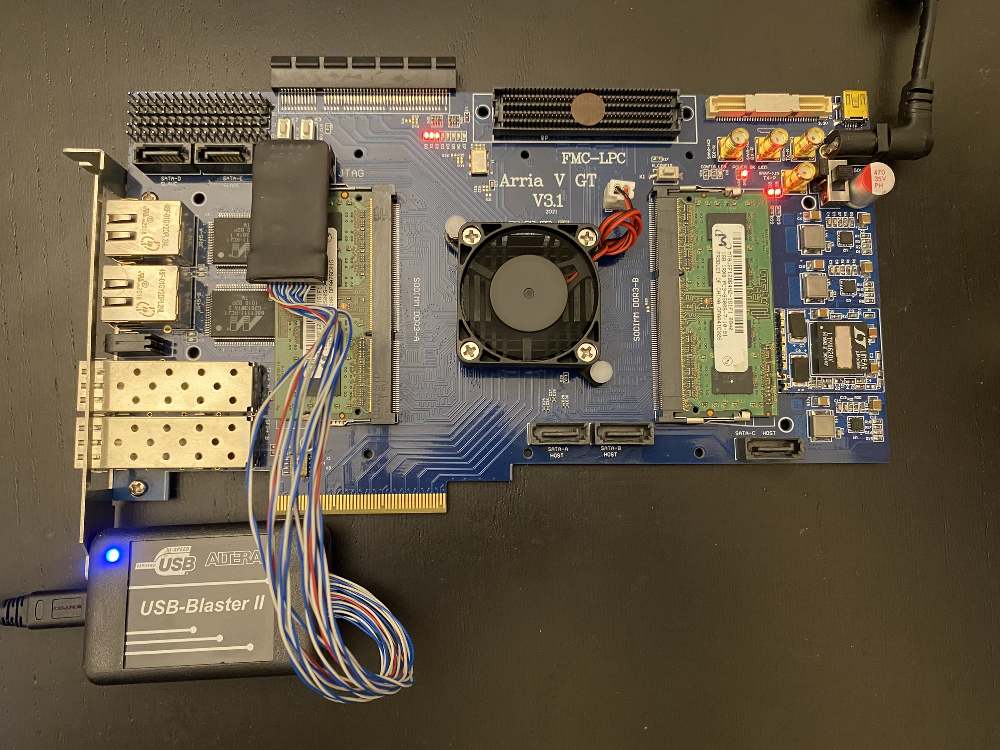

# pcie-mitm
A LiteX FPGA design for PCIe MITM, sniffing, fuzzing, and device emulation.

Targets the [Arria V GT v3.1 board](https://www.aliexpress.com/item/4001305962241.html) from [HPC FPGA Board Store](https://www.aliexpress.com/store/5585224) on AliExpress. This board comes with both a PCIe root port and and endpoint port.

